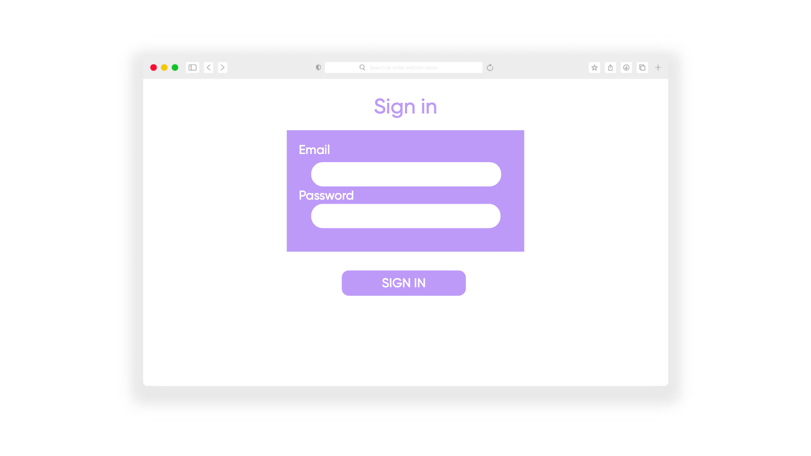

# Planning for Second Love
"Second Love" is a full-stack MERN (MongoDB, Express, React, Node) application that provides a platform for users to buy and sell second-hand items. It serves as a marketplace where individuals can find pre-owned goods at affordable prices and also sell their own items to interested buyers.

## Analyze the app's functionality

[Trello board](https://trello.com/b/flnCzX72/second-love-project-4)

## Wireframes
- Home screen 

- Item Detail 

- Cart

- Sign Up

- Get involved

## Entity Relationship Diagram
- Second Love  APP ERD:

